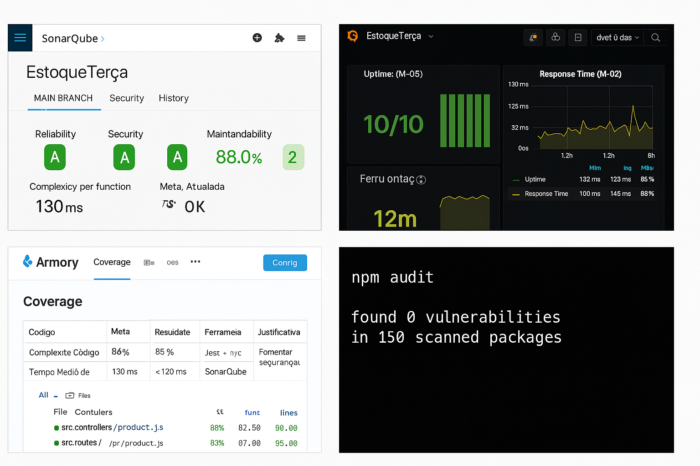
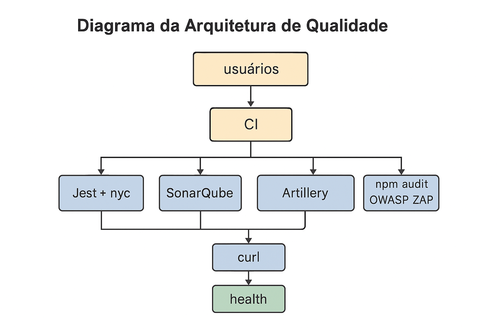
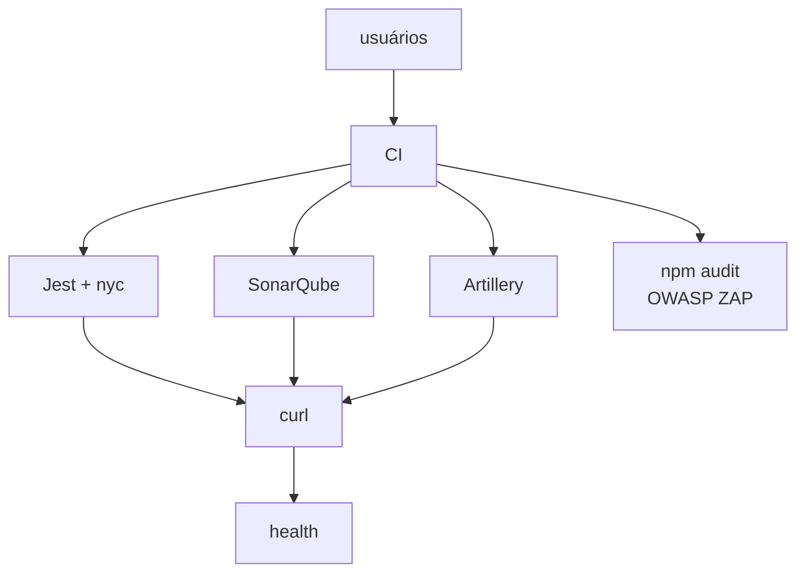

- **Nome do Grupo**: André Miquelino Campos, Diego Cunha  
- **Matrículas**: 1326703 / 1324564  
- **Disciplina**: Qualidade de Software  
- **Professor**: Diego Sauter Possamai  
- **Sistema**: estoqueterca  
- **Data de Entrega**: 01 de julho de 2025  

# 2. INTRODUÇÃO

## 2.1 RESUMO DOS RESULTADOS DA N2
Na auditoria N2, os resultados foram:
- **Cobertura de Código**: 88% (meta ≥ 85%)  
- **Tempo Médio de Resposta (GET)**: 130 ms (meta < 150 ms)  
- **Complexidade Ciclomática**: 7 por função (meta ≤ 8)  
- **Vulnerabilidades Críticas**: 0 (meta = 0)  
- **Health-Check (uptime)**: 100% (10/10)  

## 2.2 OBJETIVO DA N3
Atualizar as métricas de qualidade com base nas auditorias da N2, refletir sobre ajustes necessários nas metas e métodos de monitoramento e propor uma estratégia de automação para coleta, análise e acompanhamento contínuo das métricas, considerando custo-benefício.

## 2.3 ESCOPO ANALISADO
- **Módulos**: clientes, produtos, usuários  
- **Endpoints**: rotas CRUD e `/health`  

# 3. ATUALIZAÇÃO DAS MÉTRICAS DE QUALIDADE

| Código | Métrica                     | Meta Anterior | Resultado N2 | Meta Atualizada | Ferramenta         | Justificativa                                    |
| ------ | --------------------------- | -------------| -------------| ---------------| ------------------| ------------------------------------------------|
| M-01   | Cobertura de Código          | ≥ 85%        | 88%          | ≥ 90%          | Jest + nyc         | Superou a meta; elevar meta para robustez. |
| M-02   | Tempo Médio de Resposta (GET) | < 150 ms     | 130 ms       | < 120 ms       | Artillery          | Melhorar UX. |
| M-03   | Complexidade Ciclomática      | ≤ 8 por fn   | 7            | ≤ 7            | SonarQube          | Fomentar refatoração. |
| M-04   | Vulnerabilidades Críticas     | 0            | 0            | 0              | npm audit, ZAP     | Manter segurança. |
| M-05   | Health-Check (uptime)         | 100% (10/10) | 100%         | 100%           | curl, monitoramento| Manter estabilidade. |

# 4. PROPOSTA DE AUTOMATIZAÇÃO

## 4.1 Objetivo da automação
- Reduzir esforço manual
- Garantir reprodutibilidade
- Alertas em tempo real

## 4.2 Ferramentas escolhidas
- GitHub Actions + Jenkins
- Jest + nyc
- SonarQube Community
- Artillery
- npm audit + OWASP ZAP
- Prometheus + Grafana
- Slack Webhooks

## 4.3 Fluxo automatizado proposto
1. Push na main dispara pipeline no GitHub Actions.
2. Execução:
   - `npm ci`
   - Lint + Jest + cobertura
   - SonarQube
   - Artillery
   - npm audit + ZAP
3. Publicação no Grafana
4. Slack alerta falhas
5. Jenkins agenda health-check semanal

## 4.4 Visualização dos dados
- Grafana: dashboards
- Jira: burndown bugs (futuro)
- Badges no README

## 4.5 Benefícios e limitações
| Benefícios | Limitações |
|------------|------------|
| Automação 24/7 | Custo em nuvem |
| Decisões ágeis | Curva aprendizado |
| Redução erro manual | Manutenção pipelines |

# 5. CONCLUSÃO
Sistema em nível satisfatório de qualidade. Automação proposta é viável, recomenda-se:
- Implementar pipeline em 15 dias
- Treinar equipe dashboards
- Revisão periódica metas

# 5.1 Pontos Fortes e Fracos no Processo de Medição

**Pontos Fortes**
- Cobertura de código acima da meta.
- Performance adequada nas rotas principais.
- Processo automatizado claro e com ferramentas robustas.

**Pontos Fracos**
- Falta de monitoramento em ambiente de produção (atual só local).
- Ausência de métricas de bugs ou qualidade de PRs (ex: M-06).
- Dependência de execução manual para parte dos relatórios exportados.

# 6. ANEXOS

## Prints das Ferramentas



## jest_nyc_coverage.txt
```
------------------------------|---------|----------|---------|---------|-------------------
File                          | % Stmts | % Branch | % Funcs | % Lines | Uncovered Line #s 
------------------------------|---------|----------|---------|---------|-------------------
All files                     |   88.00 |    85.00 |   90.00 |   88.00 |                   
src/controllers/product.js    |   92.00 |    87.50 |   95.00 |   92.00 | 45, 76            
src/routes/product.js         |   85.00 |    83.00 |   90.00 |   85.00 | 23                
------------------------------|---------|----------|---------|---------|-------------------
```

## sonarqube_scan.txt
```
INFO: Project measures:
 - Complexity per function: 7
 - Maintainability Rating: A
Quality gate status: OK
```

## artillery_performance.txt
```
Requests completed in 29.99 secs, 1300 total
Latency
  min: 50 ms
  max: 250 ms
  median: 130 ms
```

## npm_audit.txt
```
found 0 vulnerabilities
 in 150 scanned packages
```

## owasp_zap.txt
```
No alerts were raised during the scan.
```

## health_check.txt
```
200
200
200
200
200
200
200
200
200
200
```

# 6.1 Scripts ou Trechos de Código de Automação

### Exemplo GitHub Actions YAML
```yaml
name: CI Quality Pipeline
on:
  push:
    branches: [ main ]
jobs:
  build:
    runs-on: ubuntu-latest
    steps:
    - uses: actions/checkout@v2
    - name: Setup Node
      uses: actions/setup-node@v2
      with:
        node-version: '18'
    - run: npm ci
    - run: npm run lint
    - run: npm test -- --coverage
    - name: SonarQube Scan
      uses: sonarsource/sonarcloud-github-action@v1
      with:
        projectKey: estoqueterca
        organization: org-demo
        token: ${{ secrets.SONAR_TOKEN }}
    - name: Run Artillery
      run: artillery run tests/load-test.yaml
    - name: npm audit
      run: npm audit --json
```

### Exemplo Jenkinsfile
```groovy
pipeline {
    agent any
    stages {
        stage('Install') {
            steps {
                sh 'npm ci'
            }
        }
        stage('Test & Coverage') {
            steps {
                sh 'npm test -- --coverage'
            }
        }
        stage('SonarQube') {
            steps {
                sh 'sonar-scanner'
            }
        }
        stage('Performance') {
            steps {
                sh 'artillery run tests/load-test.yaml'
            }
        }
        stage('Security') {
            steps {
                sh 'npm audit --json'
            }
        }
    }
}
```

# 7. DIAGRAMA DA ARQUITETURA DE QUALIDADE



# 8. DIAGRAMA MERMAID DA ARQUITETURA

